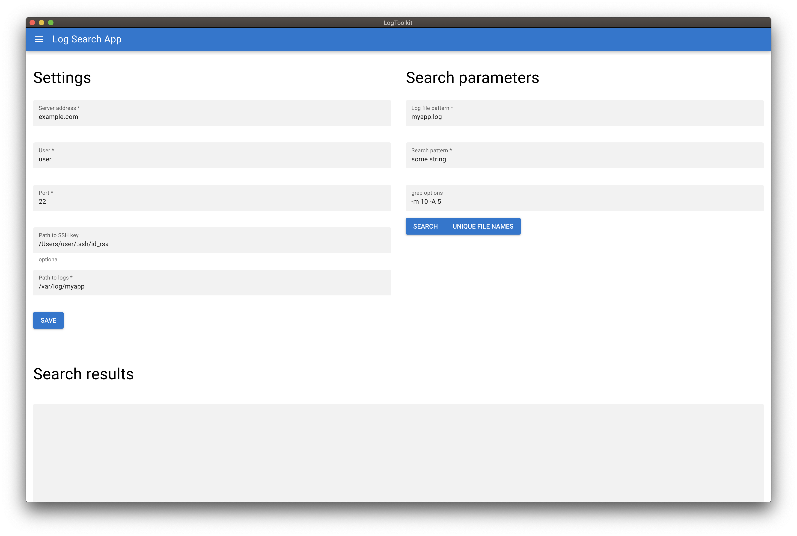

# LogToolkit Electron App

Powered with [Quasar Framework](https://quasar.dev)



## Install the dependencies
```bash
npm install
```

### Start the app in development mode (hot-code reloading, error reporting, etc.)
```bash
quasar dev -m electron
```

### Lint the files
```bash
npm run lint
```

### Build the app for MacOS
```bash
npm i -g electron-installer-dmg
quasar build -m electron
electron-installer-dmg ./dist/electron/LogToolkit-darwin-x64/LogToolkit.app LogToolkit
```

### Customize the configuration
See [Configuring quasar.conf.js](https://quasar.dev/quasar-cli/quasar-conf-js).
